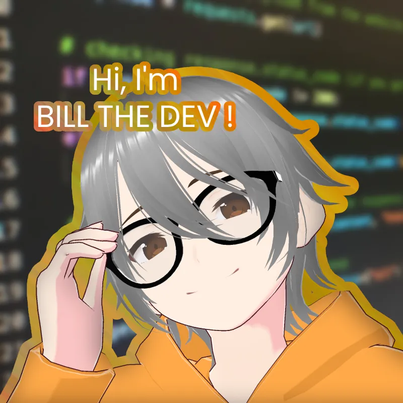
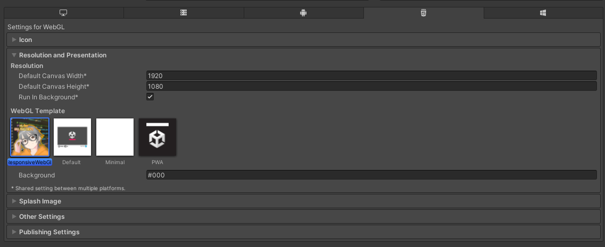

# Responsive WebGL Template by BillTheDev

  
   
  <strong style="font-size: 100px;">
    Bill
    The
    Dev
</strong>

A Unity WebGL template that provides a responsive, full-window experience.

## Features

    <strong style="font-size: 100px;" href ="#" >
        Live Preview
    </strong>
     
    

*   **Responsive Design:** Adapts to different browser window sizes, ensuring your WebGL game looks great on various screens.
*   **Full-window Display:**  The template is designed to make your WebGL game occupy the entire browser window without scrollbars.
*   **Basic Loading Bar:**  Includes a simple loading bar to provide visual feedback during the loading process.
*   **Easy to Use:**  Simply select the "ResponsiveWebGL" template in your Unity WebGL build settings.

## Installation (via .unitypackage - Recommended)

1.  **Download the .unitypackage:** Go to the [Releases](Link-to-your-GitHub-Releases-page) page of this repository and download the latest `ResponsiveWebGLTemplate.unitypackage` file.
2.  **Import into your Unity project:** In your Unity project, go to `Assets > Import Package > Custom Package...` and select the downloaded `ResponsiveWebGLTemplate.unitypackage` file.
3.  **Locate the template:** After importing, the template files will be located in `Assets/WebGLTemplates/ResponsiveWebGL/`.

## Usage
1.  **Select the template in Build Settings:**  In your Unity project, go to `File > Build Settings...`, select the WebGL platform, and click "Player Settings...". Under "Publishing Settings", find the "WebGL Template" option and choose "ResponsiveWebGL".

2.  **Build your WebGL project:** Build your Unity project for WebGL as usual (`File > Build Settings... > Build`). The resulting build will use the ResponsiveWebGL template.

## Customization

*   **Styling:** Edit the `Assets/WebGLTemplates/ResponsiveWebGL/TemplateData/style.css` file to customize the visual appearance, including background colors, fonts, and the loading bar style.
*   **Loading Bar:**  Modify the loading bar's behavior and appearance by editing `Assets/WebGLTemplates/ResponsiveWebGL/TemplateData/index.html`.
*   **Favicon:** Replace `Assets/WebGLTemplates/ResponsiveWebGL/TemplateData/favicon.ico` with your own favicon to personalize the browser tab icon.
